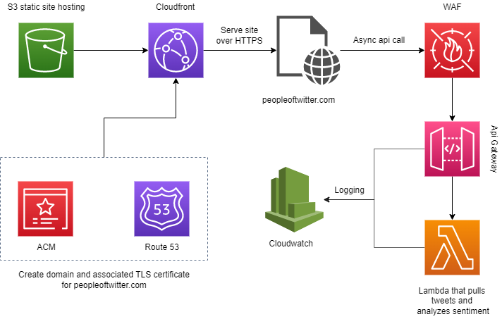

# Twitter Sentiment Analysis
See what the people of twitter think about any topic at https://peopleoftwitter.com/

### Search types
- `recent` -- pull the most recent tweets for the search term
- `popular` -- pull the most popular tweets from the last 7 days
- `mixed` -- pull a mix of the most recent and most popular tweets

### Architecture

### Security
- unicode api endpoint to avoid spam
- rate limiting based on IP with AWS WAF
- Perform some penetration testing and come up with more for this section 

To do:
- update jquery
- Finding #7, clickjacking
- Force secure connection: Applications should use transport-level encryption (SSL/TLS) to protect all communications passing between the client and the server. The Strict-Transport-Security HTTP header should be used to ensure that clients refuse to access the server over an insecure connection.
- #10. XSS filter disabled X-XSS-Protection: 1; mode=block

